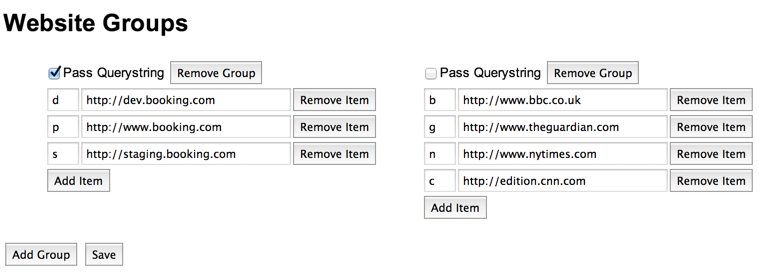
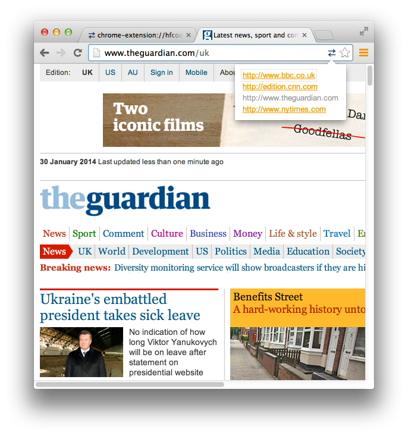

This is a fork of the original Switcher extension, tweaked to make it work for my particular use case.

These are the changes I've made:

- **Added support for Full URLs when switching domains**: so if you're browsing http://local.dev/foo/bar/, using Switcher you'll go to http://remote.server/foo/bar/
- Fixed a bug where URLs with non-standard ports (i.e: http://0.0.0.0:4000/) were not supported
- Tweaked the typography for the options screen and the URL switching popup
- Updated the icon a bit, and added missing sizes

Original README follows:

---

# Switcher

The idea for this extension came from working on an internal <http://booking.com> Chrome extension to help our frontend developers and designers test their experiments. 

Switcher is meant to be a Chrome extension boiler-plate that others can build upon. To show what's possible, it includes functionality to allow you to switch between developement, staging and production versions of a website.

But you are not constrained to just that. You can create multiple groups of sites - even sites that are not necessarily development, staging or production versions of each other. For example, you could bundle all the news sites in one group and switch between them:

But more than that, I hope it's something useful that you can extend.

I'd like to thank my employer - booking.com - for allowing me to publish this code under a permissive MIT license.

Haven't installed a Chrome extension froms source before? Follow these steps:

1. In Chrome's address bar, type: chrome://extensions
2. Click the 'Developer Mode' checkbox
3. Click the 'Load unpacked extension...' button and point the file open dialog to the folder where you downloaded/cloned Switcher.
